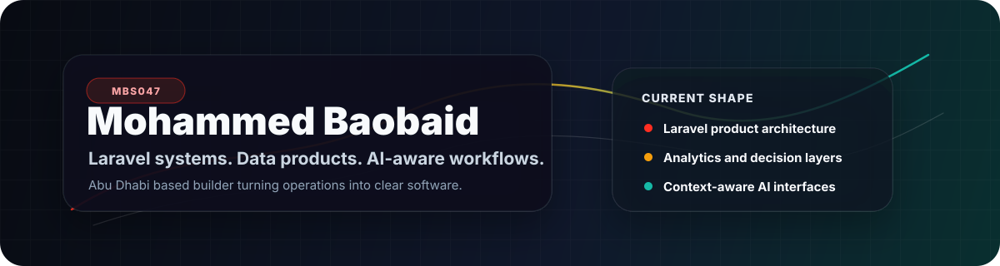
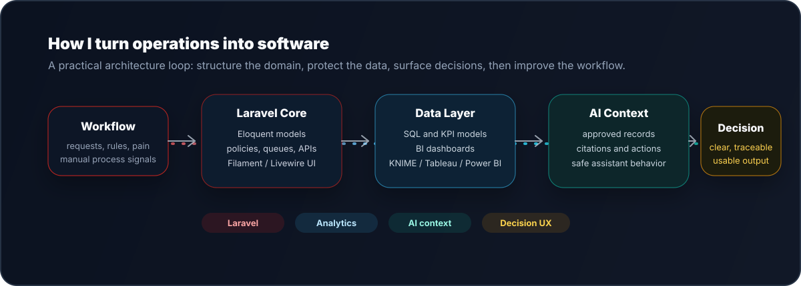

  

  

  <a href="https://baobaid.me">Portfolio</a> ·
  <a href="https://www.linkedin.com/in/mbs0/">LinkedIn</a> ·
  <a href="https://github.com/mbs047/model-mind">ModelMind</a> ·
  <a href="https://github.com/mbs047/MBS-Terminal">MBS Terminal</a>

  <strong>Laravel product engineering with data-minded systems design.</strong> 
  I build admin panels, dashboards, AI-aware workflows, and developer tools that make complex operations easier to run.

  

## Build Focus

- **Product systems:** Laravel, Filament, Livewire, APIs, queues, policies, mail, testing, and clean admin workflows.
- **Decision layers:** SQL, KPI modeling, Power BI, Tableau, KNIME, Excel, and business reporting.
- **AI interfaces:** approved context, traceable citations, safe actions, user-aware workflows, and useful assistant behavior.

## Stack

`Laravel` `PHP` `Filament` `Livewire` `Tailwind CSS` `Alpine.js` `MySQL` `PHPUnit` `REST APIs` `Queues` `OpenAI` `SQL` `Power BI` `Tableau` `KNIME`

## Selected Work

**[ModelMind](https://github.com/mbs047/model-mind)** — Laravel AI assistant package with model-aware context, citations, providers, sessions, analytics, and tests.

**[MBS Terminal](https://github.com/mbs047/MBS-Terminal)** — Windows terminal setup for Laravel/PHP development with setup, restore, theme, prompt, and workflow helpers.

**[MBS Portfolio](https://github.com/mbs047/MBS-Portfolio)** — Laravel portfolio platform with case studies, certificates, references, contact flows, SEO, and Filament admin tooling.

## Now

Product-grade Laravel delivery, analytics clarity, and developer experience tooling from Abu Dhabi, UAE.
