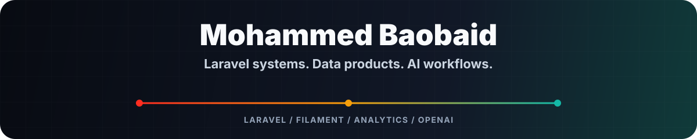

  

  
  

  <a href="https://baobaid.me">🌐 Portfolio</a> ·
  <a href="https://www.linkedin.com/in/mbs0/">💼 LinkedIn</a> ·
  <a href="https://github.com/mbs047/model-mind">🤖 ModelMind</a> ·
  <a href="https://github.com/mbs047/MBS-Terminal">🖥️ MBS Terminal</a>

  I build Laravel apps, Filament admin panels, dashboards, and AI-aware workflows that make complex operations easier to run.

### Focus

- 🧱 Laravel product systems: Filament, Livewire, APIs, queues, policies, testing.
- 📊 Data and dashboards: SQL, KPI models, Power BI, Tableau, KNIME.
- 🤖 AI interfaces: approved context, citations, safe actions, useful assistant behavior.

### Stack

`Laravel` `PHP` `Filament` `Livewire` `Tailwind` `MySQL` `PHPUnit` `OpenAI` `SQL` `Power BI` `KNIME`

### Work

- 🛒 [Cartaro](https://cartaro.co): commerce work shaped around storefront, operations, and product experience.
- 🤖 [ModelMind](https://github.com/mbs047/model-mind): model-aware AI assistant package for Laravel.
- 🖥️ [MBS Terminal](https://github.com/mbs047/MBS-Terminal): Windows terminal setup for Laravel/PHP workflows.
- 🌐 [MBS Portfolio](https://github.com/mbs047/MBS-Portfolio): Laravel portfolio, certificates, case studies, and Filament admin tooling.
