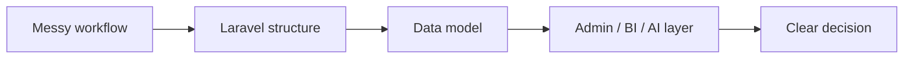

# Mohammed Baobaid

  

Laravel systems builder. Data analytics thinker. Product-polish person.

I build practical software where backend structure, useful data, and calm interfaces meet: Laravel apps, Filament panels, AI-aware workflows, BI dashboards, and developer tools.

## Build Mode

- Laravel products with Filament, Livewire, queues, policies, mail, APIs, and tests.
- Data workflows with SQL, Power BI, Tableau, KNIME, Excel, and statistical modeling.
- AI features that use approved application context instead of loose database guessing.
- Interfaces that make dense operations feel readable, traceable, and fast.

## Stack Signal

`Laravel` `PHP` `Filament` `Livewire` `Blade` `Tailwind CSS` `Alpine.js` `MySQL` `PHPUnit` `REST APIs` `Queues` `OpenAI` `SQL` `Power BI` `Tableau` `KNIME`

## Proof Points

| Work | Signal |
| --- | --- |
| [ModelMind](https://github.com/mbs047/model-mind) | Laravel AI assistant package with model-aware context, citations, providers, sessions, analytics, and tests. |
| [MBS Terminal](https://github.com/mbs047/MBS-Terminal) | Windows terminal setup for Laravel/PHP development, packaged with setup, restore, theme, prompt, and workflow helpers. |
| [MBS Portfolio](https://github.com/mbs047/MBS-Portfolio) | Laravel portfolio platform with case studies, certificates, references, contact flows, SEO, and Filament admin tooling. |

## Current Focus

Product-grade Laravel delivery, analytics clarity, and developer experience tooling.

Abu Dhabi, UAE. Open to thoughtful Laravel, data, dashboard, and workflow projects.
